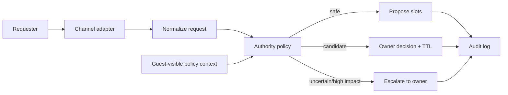

# Agent Liaison

> Codename: **三號電池** — a privacy-preserving scheduling and communication
> buffer that can act as a bounded third participant without impersonating its
> owner.

## Status

**Decision: CONTINUE. Phase 1 proves the policy core; Phase 2 proves the
same-Gateway owner-approval loop; Phase 2.1 adds bounded Main-memory context.** Google Calendar and cross-Gateway A2A are
intentionally deferred until local communication, authority, expiry, and confirmation
are reliable.

## Try the bounded prototype

Python 3.9 or newer is sufficient; the prototype has no third-party runtime
dependencies.

```bash
PYTHONPATH=src python3 -m agent_liaison.demo
PYTHONPATH=src python3 -m unittest discover -s tests -v
```

The demo exercises one same-runtime handoff: an allowlisted requester receives three
explicitly labeled **candidate** choices, the owner receives a separate approval
packet, and approval confirms exactly one choice. Without a schedule source, these
choices do not claim real availability.

## Problem

When someone cannot reach a participant, coordination stalls. A trusted agent that
knows the owner's availability and working preferences could provide useful,
explicitly tentative guidance, offer safe meeting slots, or escalate the request.

The difficult part is not calendar CRUD. It is **delegated authority**:

- What may the agent answer autonomously?
- What may it expose without leaking private calendar details?
- When is a response only tentative, and when may it become final?
- How are holds, expiration, conflicts, approvals, and audit records handled?

The intended product experience is **conversation-first**: the existing calendar is
the schedule view, and existing messaging channels provide commands, notifications,
and approval. A new destination app is not part of the initial product hypothesis.

## Business applications

- executive and recruiting scheduling without exposing calendar details;
- customer-success handoffs when the responsible person is temporarily unavailable;
- cross-team meeting negotiation across time zones and working-hour policies;
- approval-gated soft holds for sales, consulting, and field-service workflows;
- shared coordination agents that reduce interruption while preserving human authority.

The business hypothesis is measurable: reduce coordination lead time and owner
interruptions without increasing privacy incidents or false commitments.

## First bounded workflow

1. A requester submits a meeting window, duration, participants, and urgency.
2. The guest sends only typed constraints to a fixed owner workflow.
3. Main searches only for explicit scheduling preferences or time boundaries in
   owner memory. If none exist, it falls back to request constraints alone.
4. Main submits up to three bounded candidate times without exposing memory text or
   claiming calendar availability; the broker records expiry.
5. The human owner approves one candidate, proposes an alternative, or declines.
6. Only the approved result is communicated as confirmed.

Calendar requests from the owner or an allowlisted direct requester first become
`CANDIDATE` records. They do not become commitments merely because an LLM extracted
a date. A separate, visibly colored Agent Holds calendar can show policy-authorized
temporary blocks without mixing them with confirmed events.



## Why not just use a booking link?

Google Calendar, Cal.com, and similar products already solve availability and
booking. Agent Liaison should use those capabilities rather than reimplement them.
Its differentiated layer is policy-bounded negotiation and provisional answers
across communication channels.

See [research](docs/RESEARCH.md), [requirements](docs/REQUIREMENTS.md),
[architecture](docs/ARCHITECTURE.md), [decisions](docs/DECISIONS.md), the
[conversation-first workflow](docs/CONVERSATION_FIRST_WORKFLOW.md), the
[A2A and capability boundary](docs/A2A_BOUNDARY.md), and the
[publication audit](docs/PUBLICATION_AUDIT.md).

## Delivery phases

- **Phase 0 — complete:** requirements, threat model, standards, and mock examples.
- **Phase 1 — implemented:** local CLI with synthetic calendars and preferences;
  no external side effects. See [verification evidence](docs/VERIFICATION.md).
- **Phase 2 — complete:** same-Gateway candidate → owner decision → Guest confirmation
  loop with typed tools and agent-scoped isolation.
- **Phase 2.1 — implemented:** Main may use explicit scheduling preferences and time
  boundaries from owner memory to shape candidates. Missing preferences fail closed
  to request-only candidates; no memory excerpt crosses the broker.
- **Phase 3:** cross-Gateway A2A plus read-only Google Calendar FreeBusy. The same
  typed capability becomes an A2A Skill; Calendar adds authoritative conflict checks.
- **Phase 4:** a separate Agent Holds calendar with expiring tentative events and
  approval before final booking or external reply.
- **Later:** email invitations, Apple/iCloud adapters, and narrowly scoped provisional
  answers. Group monitoring remains dropped.

## Continue / drop gate

Continue after Phase 1 only if the prototype can:

- explain every decision in plain language;
- avoid exposing event details;
- distinguish tentative from confirmed states;
- reproduce outcomes from an append-only audit record; and
- fail closed when identity, time zone, or authority is ambiguous.

Drop or redesign if a simpler booking link satisfies the real workflow, if users
misread tentative responses as commitments, or if privacy requires broad calendar
access without a defensible benefit.

## Repository map

- [docs/REQUIREMENTS.md](docs/REQUIREMENTS.md) — scope and acceptance criteria
- [CONTEXT.md](CONTEXT.md) — canonical domain language
- [docs/ARCHITECTURE.md](docs/ARCHITECTURE.md) — components and state machine
- [docs/CONVERSATION_FIRST_WORKFLOW.md](docs/CONVERSATION_FIRST_WORKFLOW.md) — calendar-as-view and messaging-as-control design
- [docs/RESEARCH.md](docs/RESEARCH.md) — existing-solution preflight
- [docs/LEARNING.md](docs/LEARNING.md) — protocols and reusable concepts
- [docs/DECISIONS.md](docs/DECISIONS.md) — architectural decisions
- [SECURITY.md](SECURITY.md) — privacy, authority, and publication boundaries
- [docs/PORTFOLIO.md](docs/PORTFOLIO.md) — case-study framing and evidence gaps
- [docs/IDEA_LOG.md](docs/IDEA_LOG.md) — idea-funnel history
- [docs/PUBLICATION_AUDIT.md](docs/PUBLICATION_AUDIT.md) — privacy/security release gate
- [docs/VERIFICATION.md](docs/VERIFICATION.md) — executable acceptance evidence and gaps

## License

Released under the [MIT License](LICENSE).
