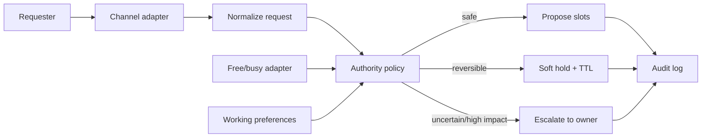

# Agent Liaison

> Codename: **三號電池** — a privacy-preserving scheduling and communication
> buffer that can act as a bounded third participant without impersonating its
> owner.

## Status

**Decision: CONTINUE to a bounded prototype.** This repository currently contains
the project skeleton and design evidence only. It has no live calendar access,
sends no messages, and cannot make commitments.

## Problem

When someone cannot reach a participant, coordination stalls. A trusted agent that
knows the owner's availability and working preferences could provide useful,
explicitly tentative guidance, offer safe meeting slots, or escalate the request.

The difficult part is not calendar CRUD. It is **delegated authority**:

- What may the agent answer autonomously?
- What may it expose without leaking private calendar details?
- When is a response only tentative, and when may it become final?
- How are holds, expiration, conflicts, approvals, and audit records handled?

The intended product experience is **conversation-first**: the existing calendar is
the schedule view, and existing messaging channels provide commands, notifications,
and approval. A new destination app is not part of the initial product hypothesis.

## Business applications

- executive and recruiting scheduling without exposing calendar details;
- customer-success handoffs when the responsible person is temporarily unavailable;
- cross-team meeting negotiation across time zones and working-hour policies;
- approval-gated soft holds for sales, consulting, and field-service workflows;
- shared coordination agents that reduce interruption while preserving human authority.

The business hypothesis is measurable: reduce coordination lead time and owner
interruptions without increasing privacy incidents or false commitments.

## First bounded workflow

1. A requester submits a meeting window, duration, participants, and urgency.
2. The liaison queries derived free/busy data, never private event titles.
3. A policy engine combines availability with explicit working preferences.
4. It returns one of: `PROPOSE_SLOTS`, `TENTATIVE_HOLD`, or `ESCALATE`.
5. Every tentative answer carries an owner, reason, confidence, and expiry time.
6. Final external booking remains approval-gated in the first live release.

Calendar mentions found in owner or opt-in group conversations first become
`CANDIDATE` records. They do not become commitments merely because an LLM extracted
a date. A separate, visibly colored Agent Holds calendar can show approved or
policy-authorized temporary blocks without mixing them with confirmed events.

## Why not just use a booking link?

Google Calendar, Cal.com, and similar products already solve availability and
booking. Agent Liaison should use those capabilities rather than reimplement them.
Its differentiated layer is policy-bounded negotiation and provisional answers
across communication channels.

See [research](docs/RESEARCH.md), [requirements](docs/REQUIREMENTS.md),
[architecture](docs/ARCHITECTURE.md), [decisions](docs/DECISIONS.md), and the
[conversation-first workflow](docs/CONVERSATION_FIRST_WORKFLOW.md), plus the
[publication audit](docs/PUBLICATION_AUDIT.md).

## Delivery phases

- **Phase 0 — current:** requirements, threat model, standards, and mock examples.
- **Phase 1:** local CLI with synthetic calendars and preferences; no external side effects.
- **Phase 2:** read-only Google Calendar free/busy plus private LINE recommendations.
- **Phase 3:** a separate Agent Holds calendar with expiring tentative events and
  approval before final booking or external reply.
- **Later:** opt-in group detection, email/calendar invitations, agent-to-agent
  negotiation, and narrowly scoped provisional answers.

## Continue / drop gate

Continue after Phase 1 only if the prototype can:

- explain every decision in plain language;
- avoid exposing event details;
- distinguish tentative from confirmed states;
- reproduce outcomes from an append-only audit record; and
- fail closed when identity, time zone, or authority is ambiguous.

Drop or redesign if a simpler booking link satisfies the real workflow, if users
misread tentative responses as commitments, or if privacy requires broad calendar
access without a defensible benefit.

## Repository map

- [docs/REQUIREMENTS.md](docs/REQUIREMENTS.md) — scope and acceptance criteria
- [docs/ARCHITECTURE.md](docs/ARCHITECTURE.md) — components and state machine
- [docs/CONVERSATION_FIRST_WORKFLOW.md](docs/CONVERSATION_FIRST_WORKFLOW.md) — calendar-as-view and messaging-as-control design
- [docs/RESEARCH.md](docs/RESEARCH.md) — existing-solution preflight
- [docs/LEARNING.md](docs/LEARNING.md) — protocols and reusable concepts
- [docs/DECISIONS.md](docs/DECISIONS.md) — architectural decisions
- [SECURITY.md](SECURITY.md) — privacy, authority, and publication boundaries
- [docs/PORTFOLIO.md](docs/PORTFOLIO.md) — case-study framing and evidence gaps
- [docs/IDEA_LOG.md](docs/IDEA_LOG.md) — idea-funnel history
- [docs/PUBLICATION_AUDIT.md](docs/PUBLICATION_AUDIT.md) — privacy/security release gate

## License

Released under the [MIT License](LICENSE).
