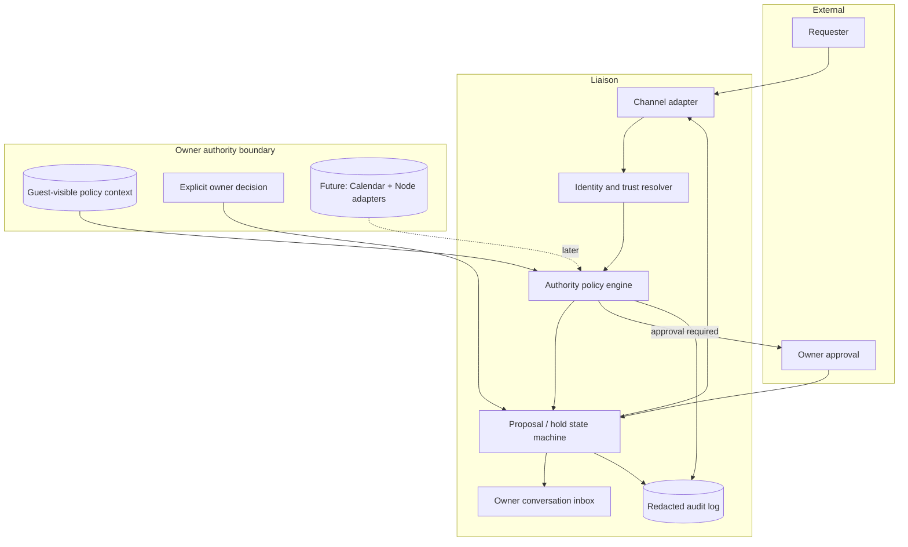
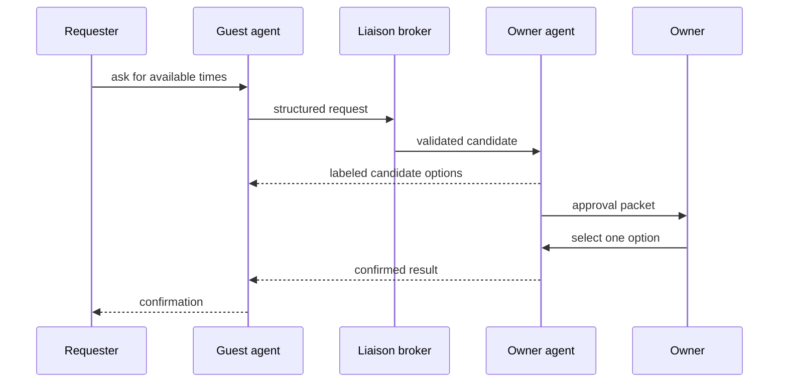

# Architecture

## Principle

Keep authority and private context behind a narrow liaison boundary. In the current
phase the conversation-facing agent receives only its own memory, requester-provided
constraints, candidate status, and the owner's final decision. Calendar and Node
sources are not consulted.



## State machine

```text
DETECTED
  ├─ no scheduling intent ─────→ DISCARDED
  └─ scheduling intent ────────→ CANDIDATE
                                  ├─ missing facts ─────→ NEEDS_CONTEXT
                                  ├─ conflict ──────────→ REPLAN_PROPOSED
                                  └─ complete request ──→ REQUESTED
REQUESTED
  ├─ invalid / unauthorized ─→ DECLINED
  ├─ uncertain / high impact ─→ AWAITING_OWNER
  └─ safe candidate found ────→ PROPOSED
                                  ├─ reversible hold ─→ HELD (expires)
                                  ├─ owner approves ──→ CONFIRMED
                                  ├─ requester rejects → DECLINED
                                  └─ TTL reached ─────→ EXPIRED
```

Confirmed events are never moved or cancelled solely by priority scoring. A conflict
creates a recommendation for the owner; only an explicit approval changes the
authoritative calendar.

## Why a dedicated boundary

The public-facing `guest` agent does not receive general Calendar, Node, owner
memory, or transcript access. It receives a narrow capability that creates a
candidate proposal from bounded fields. Future source adapters remain behind the
owner-controlled boundary and return only derived facts.

## Reliability patterns

- idempotency key per request to prevent duplicate holds;
- optimistic concurrency or compare-and-swap before confirmation;
- explicit TTL and cleanup job for soft holds;
- event-driven notification for calendar changes;
- deterministic policy rules before optional LLM wording;
- correlation IDs across channel, policy, calendar, and audit records.
- source minimization: retain a message identifier and extracted scheduling facts,
  not an unrelated conversation transcript;
- separate calendars or metadata for tentative holds and confirmed commitments.

## Brokered owner-agent handoff

The requester-facing guest agent remains minimal. It does not receive calendar,
node, owner-memory, session-history, or arbitrary cross-agent tools. Instead it may
submit one validated scheduling request to a broker with a fixed owner-agent target.



The broker accepts scheduling fields rather than arbitrary prompts. Candidate times
are derived from explicit constraints and Guest-visible policy only; they are not
claims of real availability. Generic session messaging would enlarge the
prompt-injection and transcript-access surface.
