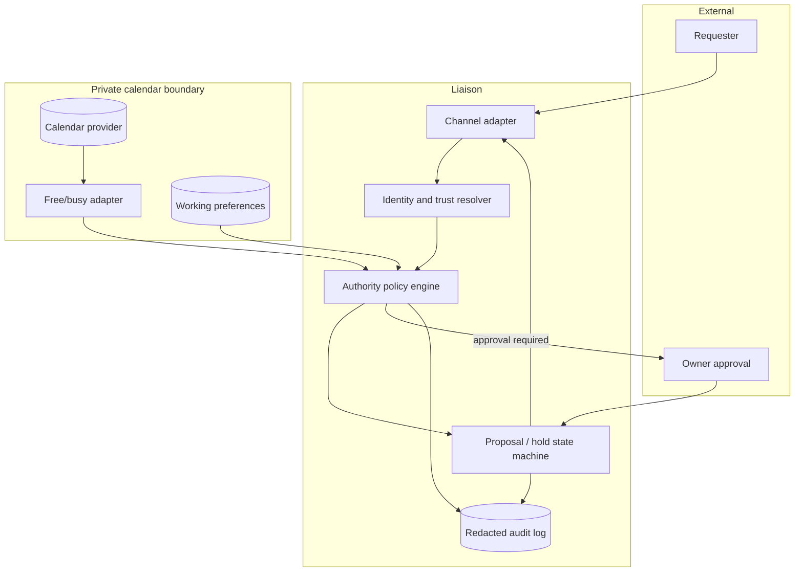

# Architecture

## Principle

Keep private calendar access behind a narrow availability boundary. The
conversation-facing agent receives derived facts such as “busy” or “three valid
slots,” not raw calendar objects.



## State machine

```text
REQUESTED
  ├─ invalid / unauthorized ─→ DECLINED
  ├─ uncertain / high impact ─→ AWAITING_OWNER
  └─ safe candidate found ────→ PROPOSED
                                  ├─ reversible hold ─→ HELD (expires)
                                  ├─ owner approves ──→ CONFIRMED
                                  ├─ requester rejects → DECLINED
                                  └─ TTL reached ─────→ EXPIRED
```

## Why a dedicated boundary

The existing public-facing `guest` agent should not receive general calendar
access. A future OpenClaw implementation should expose a narrow capability such
as `query_availability(range, duration, requester_class)` and keep raw event data
inside the owner-controlled service or a dedicated scheduling agent.

## Reliability patterns

- idempotency key per request to prevent duplicate holds;
- optimistic concurrency or compare-and-swap before confirmation;
- explicit TTL and cleanup job for soft holds;
- event-driven notification for calendar changes;
- deterministic policy rules before optional LLM wording;
- correlation IDs across channel, policy, calendar, and audit records.
