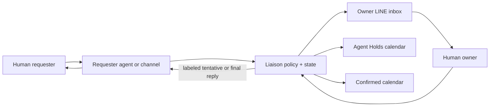

# Conversation-first workflow

## Product position

Agent Liaison is a coordination layer, not another destination platform. People use
their existing messaging channel to request, clarify, approve, or decline; they use
their existing calendar to inspect time. The system supplies policy, state, privacy,
and audit behind those surfaces.



This supports both human-agent-human and human-agent-agent-human coordination. An
agent-to-agent exchange carries only the meeting intent, derived availability,
proposal identifier, authority label, and expiry—not raw calendars or conversation
history.

## Calendar as the visual control surface

The initial source of truth is Google Calendar:

- **Confirmed calendar:** authoritative commitments.
- **Agent Holds calendar:** visibly distinct, expiring tentative reservations.
- **iPhone Calendar:** a client that can display both Google calendars when the
  Google account is enabled; it is not another data source in that topology.

Apple/iCloud-only calendars require a later provider adapter. Email adds another
event source—calendar invitations and scheduling intent—but should feed the same
candidate pipeline rather than write directly to the calendar.

## Conversation as the command surface

An owner DM contains a compact approval packet:

```text
Source: allowlisted requester via guest agent
Request: visit this week after 18:00
Conflict: overlaps a flexible focus block
Recommendation: hold 15:30–16:00; keep the earlier confirmed meeting
Authority: tentative, expires in 2 hours
Actions: approve / alternatives / decline / ask context
```

Natural-language replies remain valid: “accept this one,” “move the focus block,”
or “offer Friday morning instead.” Buttons or quick replies may reduce ambiguity,
but the workflow does not require a new application.

## Direct requester to owner-agent workflow

An allowlisted requester talks to the restricted guest agent. The guest collects a
date range, duration, time zone, and short purpose, then submits a structured request
to the liaison broker. The owner agent queries derived availability and may create
several short-lived events on the Agent Holds calendar when the owner's policy permits.

The requester receives clearly tentative options while the owner receives the same
proposal with selection actions. When the owner selects a slot, the owner agent:

1. rechecks free/busy and proposal expiry;
2. confirms the selected event;
3. deletes the sibling holds;
4. records the decision and correlation ID;
5. signals the guest agent to send the confirmation.

If any step fails, the workflow does not claim confirmation. It reports the current
state and either retries idempotently or compensates by removing stale holds.

The guest never learns why other times are unavailable and never receives raw event
objects, owner memory, node tools, or arbitrary access to the owner session.

## Is this A2A?

It is an agent-to-agent handoff in the architectural sense. Within one OpenClaw
Gateway, the first implementation should use a capability-specific broker rather than
granting the guest a general session messaging tool. A standardized cross-system A2A
protocol becomes relevant only when the requester has an independent agent on another
Gateway or vendor platform.

## Priority is a recommendation, not authority

A deterministic policy should evaluate:

- fixed versus movable commitment;
- deadline and urgency;
- requester trust tier;
- preparation, travel, and recovery buffers;
- working-hours and focus-time preferences;
- consequence of delay;
- extraction confidence and missing facts.

The model may summarize trade-offs, but it cannot infer permission to cancel or move
a confirmed event. A conflict produces `REPLAN_PROPOSED`; the owner chooses which
commitment changes.

## State and actions

```text
DETECTED → CANDIDATE → NEEDS_CONTEXT | PROPOSED | REPLAN_PROPOSED
PROPOSED → HELD → APPROVED → CONFIRMED
                    └──────→ DECLINED
HELD → EXPIRED
```

Every transition carries a correlation ID, policy version, actor, reason code, and
timestamp. Repeated channel delivery uses the same idempotency key and cannot create
duplicate holds.

## Recommended delivery sequence

1. Synthetic conversation fixtures produce candidates and approval packets.
2. Read-only Google free/busy drives private LINE recommendations.
3. A separate Agent Holds calendar receives reversible expiring holds.
4. Owner approval promotes a hold and permits an external response.
5. The restricted guest can submit one schema-validated request to the broker.
6. Narrow tentative replies are enabled for explicit requester/policy classes.
7. Email invitations and Apple/iCloud-only calendars become additional adapters.
8. Cross-system agent negotiation adopts a standard A2A protocol only when needed.

## Primary references

- [Google Calendar free/busy](https://developers.google.com/workspace/calendar/api/v3/reference/freebusy/query)
- [Google Calendar events](https://developers.google.com/workspace/calendar/api/v3/reference/events/insert)
- [LINE webhook events](https://developers.line.biz/en/reference/messaging-api/#webhook-event-objects)
- [OpenClaw session tools](https://docs.openclaw.ai/concepts/session-tool)
- [OpenClaw cross-agent configuration](https://docs.openclaw.ai/gateway/config-tools/sessions-and-subagents)
- [Apple Calendar accounts](https://support.apple.com/guide/iphone/use-multiple-calendars-iph3d1110d4/ios)
- [iCalendar status](https://datatracker.ietf.org/doc/html/rfc5545#section-3.8.1.11)
- [iCalendar time transparency](https://datatracker.ietf.org/doc/html/rfc5545#section-3.8.2.7)
