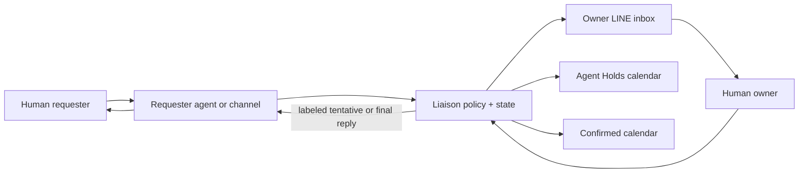

# Conversation-first workflow

## Product position

Agent Liaison is a coordination layer, not another destination platform. People use
their existing messaging channel to request, clarify, approve, or decline; they use
their existing calendar to inspect time. The system supplies policy, state, privacy,
and audit behind those surfaces.



This supports both human-agent-human and human-agent-agent-human coordination. An
agent-to-agent exchange carries only the meeting intent, derived availability,
proposal identifier, authority label, and expiry—not raw calendars or conversation
history.

## Calendar as the visual control surface

The initial source of truth is Google Calendar:

- **Confirmed calendar:** authoritative commitments.
- **Agent Holds calendar:** visibly distinct, expiring tentative reservations.
- **iPhone Calendar:** a client that can display both Google calendars when the
  Google account is enabled; it is not another data source in that topology.

Apple/iCloud-only calendars require a later provider adapter. Email adds another
event source—calendar invitations and scheduling intent—but should feed the same
candidate pipeline rather than write directly to the calendar.

## Conversation as the command surface

An owner DM contains a compact approval packet:

```text
Source: opt-in project group
Request: 30-minute review this Thursday afternoon
Conflict: overlaps a flexible focus block
Recommendation: hold 15:30–16:00; keep the earlier confirmed meeting
Authority: tentative, expires in 2 hours
Actions: approve / alternatives / decline / ask context
```

Natural-language replies remain valid: “accept this one,” “move the focus block,”
or “offer Friday morning instead.” Buttons or quick replies may reduce ambiguity,
but the workflow does not require a new application.

## Group-conversation boundary

A bot in a group may receive messages beyond the scheduling request. Safe handling
therefore requires:

1. visible opt-in and a clear bot identity;
2. processing only direct mentions of the owner or liaison plus scheduling intent;
3. discarding unrelated content;
4. retaining extracted fields and a source reference rather than the full transcript;
5. showing the owner the source and proposed action before a commitment;
6. sending a group reply only when the authority policy permits it.

The first group release should observe and privately recommend. Autonomous group
replies can follow only after labeled tentative language and expiry behavior are
shown to be consistently understood.

## Priority is a recommendation, not authority

A deterministic policy should evaluate:

- fixed versus movable commitment;
- deadline and urgency;
- requester trust tier;
- preparation, travel, and recovery buffers;
- working-hours and focus-time preferences;
- consequence of delay;
- extraction confidence and missing facts.

The model may summarize trade-offs, but it cannot infer permission to cancel or move
a confirmed event. A conflict produces `REPLAN_PROPOSED`; the owner chooses which
commitment changes.

## State and actions

```text
DETECTED → CANDIDATE → NEEDS_CONTEXT | PROPOSED | REPLAN_PROPOSED
PROPOSED → HELD → APPROVED → CONFIRMED
                    └──────→ DECLINED
HELD → EXPIRED
```

Every transition carries a correlation ID, policy version, actor, reason code, and
timestamp. Repeated channel delivery uses the same idempotency key and cannot create
duplicate holds.

## Recommended delivery sequence

1. Synthetic conversation fixtures produce candidates and approval packets.
2. Read-only Google free/busy drives private LINE recommendations.
3. A separate Agent Holds calendar receives reversible expiring holds.
4. Owner approval promotes a hold and permits an external response.
5. Opt-in LINE group detection is enabled in observe-only mode.
6. Narrow tentative replies are enabled for explicit requester/policy classes.
7. Email invitations and Apple/iCloud-only calendars become additional adapters.
8. Agent-to-agent negotiation exchanges minimal structured proposals.

## Primary references

- [Google Calendar free/busy](https://developers.google.com/workspace/calendar/api/v3/reference/freebusy/query)
- [Google Calendar events](https://developers.google.com/workspace/calendar/api/v3/reference/events/insert)
- [LINE group chats](https://developers.line.biz/en/docs/messaging-api/group-chats/)
- [LINE webhook events](https://developers.line.biz/en/reference/messaging-api/#webhook-event-objects)
- [Apple Calendar accounts](https://support.apple.com/guide/iphone/use-multiple-calendars-iph3d1110d4/ios)
- [iCalendar status](https://datatracker.ietf.org/doc/html/rfc5545#section-3.8.1.11)
- [iCalendar time transparency](https://datatracker.ietf.org/doc/html/rfc5545#section-3.8.2.7)
